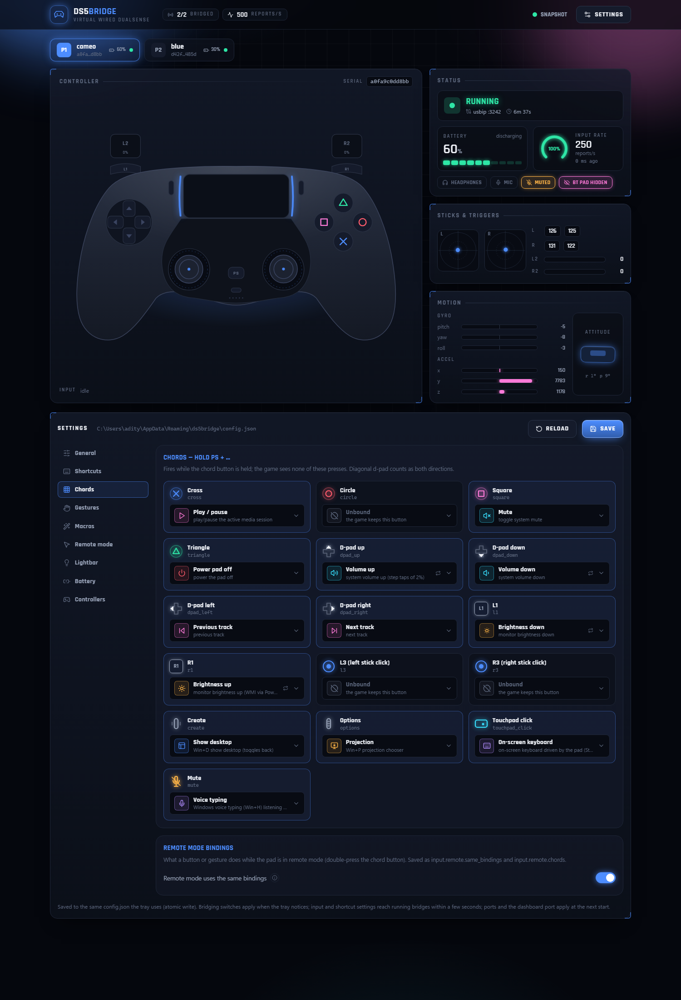
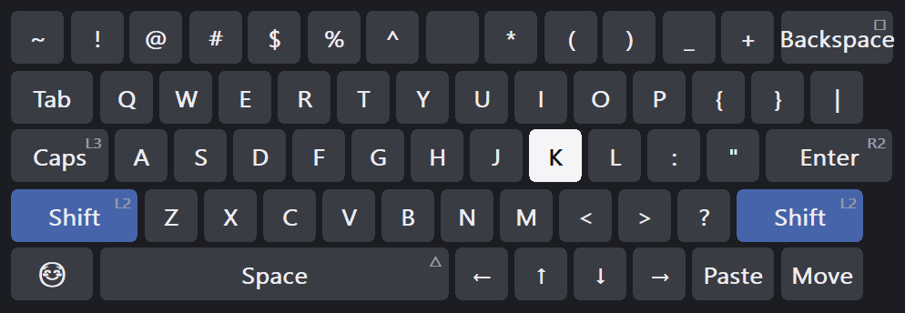

# DualSense Bridge

It emulates a virtual PlayStation 5 controller dongle, enabling full DualSense
functionality over Bluetooth without any additional hardware.

Also, while at it, it provides an amazing input layer to control your PC,
utilising the PS touchpad to its maximum capability, mimicking a laptop's
touchpad. All of that input is processed before the emulation layer, so PC
control inputs via the controller don't interfere with any games.

### Chords

Hold the PS button and the other buttons become shortcuts — the game never
sees them. Out of the box: PS + Cross is play/pause, the d-pad is volume and
track, L1/R1 is screen brightness, Options is Win+P, Create is Show Desktop,
Triangle switches the pad off, the touchpad click opens an on-screen keyboard
driven by the pad, and the mic button starts Windows voice typing listening
through the controller's own microphone. A plain PS tap still reaches the game.
Every binding is editable in the dashboard, and changes apply live.



### Remote mode

Double-press PS and the pad stops driving the game and drives the PC instead:
one finger on the touchpad is the mouse, a tap is a click, two fingers scroll
and pinch-zoom, a two-finger slide while clicked is Alt-Tab, the sticks move
the pointer and scroll, Cross clicks, Circle is Escape, the d-pad is the arrow
keys, and the lightbar turns orange so you know. Double-press again to hand it
back to the game. It ships off; switch it on from the dashboard.



The full keymap, every gesture and how the engine hooks in are in
[`docs/input-shortcuts.md`](docs/input-shortcuts.md).

## How it works

Inspired by [daidr/dualsense-tester](https://github.com/daidr/dualsense-tester)
and [awalol/DS5Dongle](https://github.com/awalol/DS5Dongle), it emulates a
virtual USB connection, which appears like a wired DS5 connection, and a script
reads input via Bluetooth and sends it via the emulated connection, fooling the
PC into believing the controller is connected via USB. All of this has always
been possible, as demonstrated by daidr over Bluetooth on Windows; just an
appropriate driver layer was missing. That layer is USB/IP, through
[usbip-win2](https://github.com/vadimgrn/usbip-win2)'s Microsoft-signed driver.
Everything else is a user-mode Python program.

## To get started

You need **Windows 10 x64 (1903+) or Windows 11** and a **DualSense paired
over Bluetooth**. The installer brings the two drivers it depends on:
[usbip-win2](https://github.com/vadimgrn/usbip-win2) 0.9.7.7 (Microsoft-signed;
**not** 0.9.7.8, whose own maintainer warns it can corrupt memory) and,
optionally, [HidHide](https://github.com/nefarius/HidHide) 1.5.230, which hides
the Bluetooth pad from games while it is bridged so they do not see two
controllers.

### Install the exe

Download **`ds5bridge-setup-<version>-bundled.exe`** from the
[latest release](../../releases/latest) and run it — that is the whole
install. Everything is inside the file (the app, usbip-win2 and HidHide), so
nothing is downloaded during the install and it works offline. You get a
checkbox per component, a System Restore point before the driver goes in, an
*Installation check* page at the end, and an entry in Settings → Apps whose
uninstaller takes the drivers back out. Silent switches and the rest are in
[`docs/installer.md`](docs/installer.md).

Nothing is code-signed yet, so Windows shows **"Windows protected your PC"**
the first time: *More info → Run anyway*. SmartScreen is reacting to the
installer and the app, not to the drivers, which are signed by their own
publishers.

### Single command install

The same installer, fetched and run from PowerShell:

```powershell
irm https://raw.githubusercontent.com/Macle57/ds5-virtual-cable/main/scripts/install.ps1 | iex
```

That looks up the latest release, downloads its installer, checks it against
the release's `SHA256SUMS`, and runs it. Options (`-Silent`, `-NoHidHide`,
`-Autostart`, `-DryRun`, …) go through the scriptblock form:

```powershell
& ([scriptblock]::Create((irm https://raw.githubusercontent.com/Macle57/ds5-virtual-cable/main/scripts/install.ps1))) -DryRun
```

After either install, the tray icon bridges every controller that is switched
on, picks up ones you turn on later, and can start itself when you log in — so
the routine is "turn the controller on, start the game". The tray menu switches
any controller back to plain Bluetooth, opens the dashboard where everything is
configured, and offers new releases as they appear. Step-by-step instructions
and the uninstaller live in [`docs/USER-GUIDE.md`](docs/USER-GUIDE.md).
Uninstalling needs **one restart** to finish, because usbip-win2's driver
cannot be unloaded while Windows is running.

### Build from source

Install usbip-win2 0.9.7.7 (and HidHide if you want it) from their own
releases, or run the installer above with only the drivers ticked. Then, with
Python 3.12+:

```powershell
git clone https://github.com/Macle57/ds5-virtual-cable.git
cd ds5-virtual-cable
python -m venv prototype\.venv
prototype\.venv\Scripts\python.exe -m pip install hidapi numpy av

powershell -File app\tools\dev_tray.ps1          # the real tray, from source, with live logs
powershell -File app\tools\dev_tray.ps1 -Stop    # put it down again, cleanly
```

That tray is the same one the exe shows, so nothing has to be packaged to work
on it. The command-line form is `python -m ds5app` from `app\` (`devices`,
`doctor`, `cleanup` and `tray` are its subcommands), and
`powershell -File app\packaging\build.ps1` builds the exe. Stop it through the
script, the tray's Quit item or Ctrl+C — not Task Manager, because the teardown
is what detaches the virtual device and unhides the Bluetooth pad. The
dashboard page is a Vite + React project in `app/dashboard-ui/`; its built
output is committed, so a Python-only checkout still works. Dev setup, the test
suite and the hardware-test protocol are in
[`CONTRIBUTING.md`](CONTRIBUTING.md).

## Measured

Everything below is from instrumented runs against the real driver, on real
hardware. Full evidence, including the failures, is in `docs/e2e-results.md`.

| | measured | target |
|---|---|---|
| input rate to the game | **250.33 reports/s** | 250 (a real wired pad's `bInterval = 6`) |
| input fidelity | **100.00 % field parity** over 30 s, against a simultaneous direct Bluetooth read | exact |
| dropped/duplicated sequence numbers | **0** | 0 |
| audio out | **1000.3 packets/s**, every packet full | 1000 |
| audio in | **1001.1 packets/s** | 1000 |
| audio underruns in a 120 s soak | **1 per endpoint, both at stream start** | ≤1 |
| dropped audio frames, ring overflows, write errors, Opus decode errors | **0** each | 0 |
| speaker output, heard back through the controller's own mic | **+64.4 dB** at the commanded frequency | detectable |
| haptic output, same method, audio stream silent | **+27.8 dB** at the commanded frequency | detectable |
| Bluetooth link rate, steady state | ~480 Hz | — |
| unit tests | **728** — 243 for the protocol and the emulator, 485 for the settings, the multi-controller manager and the tray. None needs hardware or a driver; a stdlib-only subset runs on bare Python (enforced in CI) | — |
| two controllers at once | **250 reports/s each**, one process per controller | 250 |

The audio tests are deliberately *frequency-selective* — they only pass if
energy appears at the exact frequency that was commanded — so a noisy room
cannot fake a result.

## Frequently asked

**Is this a driver? Does it need Secure Boot off, or test-signing?**
No. This project is a normal user-mode program; if it crashes, a Python process
exits. The only kernel component is usbip-win2's UDE driver, which is
**signed by Microsoft** and which the installer brings from its own project.
Nothing here disables a security feature, and nothing modifies Windows.

**Will anti-cheat software have a problem with this?**
**Be honest with yourself before you use it in a competitive game, and check the
game's terms of service.** Here is what I actually know:

- What a game sees is an ordinary USB HID gamepad and an ordinary USB audio
  device on a normal `USB\VID_054C&PID_0CE6` devnode, bound to Microsoft's own
  class drivers. The descriptors are byte-identical to a real wired DualSense.
- What distinguishes it, if anything looks: the parent host controller is
  `ROOT\USB\0000` with service `usbip2_ude` rather than a PCI controller, and
  the devnode has no `LocationPaths`. A kernel anti-cheat that enumerates the
  USB tree **can** see this.
- **I make no evasion claims and have implemented nothing to hide it.** This
  project exists to enable features on hardware you already own, not to
  misrepresent input. It does not synthesise, modify, remap or automate any
  input into a game — every button, stick and trigger value the game sees is
  your controller's own, forwarded unchanged. The chords and remote mode only
  ever *remove* presses from what the game sees; they never add any.
- No anti-cheat system has been tested against it. If you try one, say so in an
  issue.

**What about latency? Is it as good as a cable?**
**Unknown, and I would rather say so than guess.** End-to-end latency has not
been measured. What *is* measured: the Bluetooth link delivers input at ~480 Hz,
faster than the 250 Hz a wired DualSense is polled at, so the input path is not
starved. The audio path buffers deliberately — about 43 ms of encoded audio
queued toward the controller, and 10–90 ms in the microphone jitter buffer —
because Bluetooth delivery is bursty and dropped audio is worse than delayed
audio. Expect a cable to still be better for audio. For buttons and sticks, the
extra hop is a translation and a memcpy.

**Does it work over USB, i.e. is it useful when the controller is plugged in?**
No, and it would be pointless — a plugged-in DualSense already *is* a wired
DualSense. This bridges Bluetooth specifically.

**Does it modify my controller, or my games?**
No. Feature *writes* to the controller — the reports that re-pair it or touch
its firmware — are deliberately blocked and never forwarded, even if a host
asks. The only writes allowed through are the two transient audio test
commands (the "play a tone" pair that tools like dualsense-tester send),
which change nothing persistent. Feature reads are served from a small cache
primed at startup.

**Will Sony break this in a firmware update?**
Possibly. It speaks the controller's existing Bluetooth protocol, which Sony has
no obligation to keep stable. Two firmware revisions have been tested.

**My controller feels flaky / audio glitches / reports stop.**
**Check the battery first.** A dying DualSense produces failure modes that look
exactly like protocol bugs — this cost me real debugging time during
development, twice. Read the battery level, charge it, try again.

## Documentation

| | |
|---|---|
| `docs/USER-GUIDE.md` | how to install and use it, for people who just want it to work |
| `docs/input-shortcuts.md` | chords, gestures, remote mode, the on-screen keyboard and voice typing |
| `docs/installer.md` | the setup exe and its uninstaller: every checkbox, the silent switches, the reboot sequence |
| `docs/STATUS.md` | the full engineering history: what is verified, what is not, every trap |
| `docs/e2e-results.md` | the end-to-end results, with numbers and with the defects found |
| `docs/FINDINGS.md` | the reverse-engineered Bluetooth protocol |
| `docs/usb-ground-truth.md` | the real controller's USB descriptors, and how to re-read them |
| `docs/virtualization-options.md` | why USB/IP, and what the alternatives would have cost |
| `docs/provenance.md` | the licence and provenance audit |
| `CONTRIBUTING.md` | dev setup, the test suite, and the hardware-test protocol |

## Credits

This was built on other people's published work. In particular
**[daidr/dualsense-tester](https://github.com/daidr/dualsense-tester)** (the
most complete public account of the DualSense Bluetooth protocol),
**[awalol/DS5Dongle](https://github.com/awalol/DS5Dongle)** (which proved the
idea in hardware first) and **[vadimgrn/usbip-win2](https://github.com/vadimgrn/usbip-win2)**
(the signed driver that makes a user-mode approach possible at all).

Full credits, including the prior research that shaped the design, are in
[`ATTRIBUTIONS.md`](ATTRIBUTIONS.md). Exactly what is derived from what is in
[`docs/provenance.md`](docs/provenance.md).

## Licence

[MIT](LICENSE). See [`NOTICE`](NOTICE) for the notices of the MIT-licensed
projects this borrows from.

---

### Trademarks and affiliation

"PlayStation", "DualSense" and "DUALSHOCK" are trademarks or registered
trademarks of **Sony Interactive Entertainment Inc.** "Windows" is a trademark
of Microsoft Corporation. All other trademarks are the property of their
respective owners.

**This project is not affiliated with, authorised by, endorsed by, sponsored by
or in any way officially connected to Sony Interactive Entertainment Inc. or any
of its subsidiaries or affiliates.** Those names are used here only to identify
the hardware this software interoperates with, as permitted by nominative fair
use. No Sony code, firmware or asset is distributed with this project. It
requires you to own the controller it talks to.

Provided "as is", without warranty of any kind. Use it at your own risk, and
check the terms of service of any online game before using it there.
