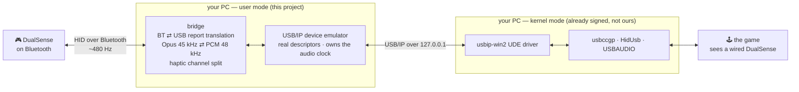

<!--
  PROJECT NAME PLACEHOLDER: "PhantomCable".
  It appears in this file, LICENSE, NOTICE, ATTRIBUTIONS.md, SECURITY.md,
  CONTRIBUTING.md, .github/ and nowhere else -- no Python package, module or
  import uses it. To rename, see the one-liner in CONTRIBUTING.md.
-->

# PhantomCable

**Your wireless controller, pretending to be plugged in.**

Windows sees a wired PS5 controller. There is no cable. The real one is across
the room on Bluetooth, and every feature that normally only works over USB —
HD haptics, adaptive triggers, the built-in speaker, the headphone jack, the
microphone — works anyway.

No kernel driver of our own. No patched games. No system files touched.
It is a Python program that answers USB requests convincingly enough that
Windows, and the games on it, cannot tell the difference.

> **Status: it works, and a game proved it.**
> *Marvel's Spider-Man: Miles Morales* (the Sony PC port) detected the virtual
> controller as wired and turned on adaptive triggers, HD haptics, the speaker
> and the lightbar with no configuration at all. Measured on a 120-second soak:
> **250 Hz input, 100 % field-accurate, 1000 audio packets/s in both directions,
> zero underruns.**

---

## Why this exists

Plug a DualSense into a PC with a USB cable and Sony-published games light up:
the triggers push back, the haptics have texture, dialogue comes out of the
controller's speaker.

Connect the same controller over Bluetooth and most of that quietly disappears.
The games check for a *wired* controller and its matching USB audio device, and
a Bluetooth pad has neither — even though the controller itself is perfectly
capable of all of it over Bluetooth. The hardware can do it. The link is fine.
The only thing missing is the shape of a USB cable.

PhantomCable supplies that shape.

## How it works

Windows already ships everything needed to *consume* a USB device that lives on
the network — that is what USB/IP is. So instead of writing a driver, this
project writes the **device**: a user-mode program that speaks the USB/IP wire
protocol and answers as a wired DualSense would, while a real Bluetooth
controller supplies the actual data on the other side.



Four pipes run at once, in both directions:

| what the game does | what actually happens |
|---|---|
| polls the controller at 250 Hz | Bluetooth input report `0x31` → USB input report `0x01`, one field-for-field slice |
| sets triggers / rumble / lightbar | USB output `0x02` → Bluetooth `0x31`, wrapped and CRC-32 signed |
| plays audio to the "controller speakers" | 4-channel 48 kHz PCM → Opus at 45 kHz + 3 kHz haptic PCM → Bluetooth `0x39` |
| records from the "controller mic" | Bluetooth Opus frames → decoded → the virtual USB capture endpoint |

Channels 0/1 of that 4-channel audio device are the speaker; channels 2/3 are
the haptic voice coils. That is not a guess — driving 2/3 alone, with the audio
stream carrying literal digital silence, still produces a measurable tone.

There is one design fact worth knowing, because everything else follows from it:
**over USB/IP there is no bus clock, so the emulator *is* the audio clock.**
Nothing else paces the stream. Before that was understood, a 48 kHz audio stream
happily ran at 174 429 frames/s — 3.6× real time — and Windows reported zero
problems. The emulator now hands out 1 ms service intervals itself.

## What you need

- **Windows 10 x64 (1903+) or Windows 11.**
- **A DualSense controller** paired over Bluetooth. (A second one, wired, is
  only needed if you want to reproduce the development measurements.)
- **[usbip-win2](https://github.com/vadimgrn/usbip-win2) 0.9.7.7 or later.**
  Its drivers are **signed by Microsoft** — no test-signing, no unsigned-driver
  mode, no BIOS changes. Install it from its own releases page.
  **Do not install 0.9.7.8**; its own maintainer warns it can corrupt memory.
- **Python 3.12+** if you are running from source.

**Create a system restore point before installing usbip-win2.** Its own README
says so and so do we: it installs two kernel drivers and restarts every USB 3.0
hub on the machine while it does.

## Getting it running

Two ways.

**The easy way** — the packaged app, if a release is available for your
platform: download it, install usbip-win2, run it, pick your controller.
Step-by-step instructions with screenshots live in the user guide
(`docs/USER-GUIDE.md`).

**From source:**

```powershell
git clone <this repo>
cd <repo>
python -m venv prototype\.venv
prototype\.venv\Scripts\python.exe -m pip install hidapi numpy av

# 1. start the emulator, pointed at your controller's Bluetooth address
cd emulator
..\prototype\.venv\Scripts\python.exe -m ds5emu serve --backend bridge --port 3241

# 2. in a second terminal, attach it (--tcp-port is GLOBAL and goes first)
& "C:\Program Files\USBip\usbip.exe" --tcp-port 3241 attach -r 127.0.0.1 -b 1-1
```

Windows enumerates a wired DualSense. Launch your game.

When you are done:

```powershell
& "C:\Program Files\USBip\usbip.exe" attach -X    # stop the auto-reattach
& "C:\Program Files\USBip\usbip.exe" detach -p 1
```

The `attach -X` is not optional — `usbip attach` arms a background re-attach,
and without it you quietly collect a second virtual device.

**If you have paired more than one controller, pass `--bt-serial <bdaddr>`.**
A controller charging over a USB cable *still* enumerates over Bluetooth as a
stale entry whose reads fail, and it can sort first. To see what is actually
there:

```powershell
cd <repo>\prototype
.venv\Scripts\python.exe -m ds5bridge list
```

**Port 3240 is usually taken** by `usbipd-win` (the Microsoft WSL passthrough
tool), which is why everything above uses 3241. Nothing needs to be stopped or
uninstalled.

## Verified

### Games

| game | result | notes |
|---|---|---|
| **Marvel's Spider-Man: Miles Morales** (PC) | ✅ **Pass** | Detected as a wired DualSense. Adaptive triggers, HD haptics, speaker and lightbar all worked immediately, with no configuration. User-tested, 2026-08-25. |

That is a table of one, honestly. If you try another game, please
[open an issue](../../issues/new/choose) and say what happened — that is the
single most useful contribution right now.

### Measured

Everything below is from instrumented runs against the real driver, on real
hardware. Full evidence, including the failures, is in `docs/e2e-results.md`.

| | measured | target |
|---|---|---|
| input rate to the game | **250.33 reports/s** | 250 (a real wired pad's `bInterval = 6`) |
| input fidelity | **100.00 % field parity** over 30 s, against a simultaneous direct Bluetooth read | exact |
| dropped/duplicated sequence numbers | **0** | 0 |
| audio out | **1000.3 packets/s**, every packet full | 1000 |
| audio in | **1001.1 packets/s** | 1000 |
| audio underruns in a 120 s soak | **1 per endpoint, both at stream start** | ≤1 |
| dropped audio frames, ring overflows, write errors, Opus decode errors | **0** each | 0 |
| speaker output, heard back through the controller's own mic | **+64.4 dB** at the commanded frequency | detectable |
| haptic output, same method, audio stream silent | **+27.8 dB** at the commanded frequency | detectable |
| Bluetooth link rate, steady state | ~480 Hz | — |
| unit tests | **173**, of which 132 need no hardware, no driver and no third-party package | — |

The audio tests are deliberately *frequency-selective* — they only pass if
energy appears at the exact frequency that was commanded — so a noisy room
cannot fake a result.

## Frequently asked

**Is this a driver? Does it need Secure Boot off, or test-signing?**
No. This project is a normal user-mode program; if it crashes, a Python process
exits. The only kernel component is usbip-win2's UDE driver, which is
**signed by Microsoft** and which you install separately from its own project.
Nothing here disables a security feature, and nothing modifies Windows.

**Will anti-cheat software have a problem with this?**
**Be honest with yourself before you use it in a competitive game, and check the
game's terms of service.** Here is what we actually know:

- What a game sees is an ordinary USB HID gamepad and an ordinary USB audio
  device on a normal `USB\VID_054C&PID_0CE6` devnode, bound to Microsoft's own
  class drivers. The descriptors are byte-identical to a real wired DualSense.
- What distinguishes it, if anything looks: the parent host controller is
  `ROOT\USB\0000` with service `usbip2_ude` rather than a PCI controller, and
  the devnode has no `LocationPaths`. A kernel anti-cheat that enumerates the
  USB tree **can** see this.
- **We make no evasion claims and have implemented nothing to hide it.** This
  project exists to enable features on hardware you already own, not to
  misrepresent input. It does not synthesise, modify, remap or automate any
  input — every button, stick and trigger value is your controller's own,
  forwarded unchanged.
- No anti-cheat system has been tested against it. If you try one, say so in an
  issue.

**What about latency? Is it as good as a cable?**
**Unknown, and we would rather say so than guess.** End-to-end latency has not
been measured. What *is* measured: the Bluetooth link delivers input at ~480 Hz,
faster than the 250 Hz a wired DualSense is polled at, so the input path is not
starved. The audio path buffers deliberately — about 43 ms of encoded audio
queued toward the controller, and 10–90 ms in the microphone jitter buffer —
because Bluetooth delivery is bursty and dropped audio is worse than delayed
audio. Expect a cable to still be better for audio. For buttons and sticks, the
extra hop is a translation and a memcpy.

**Does it work over USB, i.e. is it useful when the controller is plugged in?**
No, and it would be pointless — a plugged-in DualSense already *is* a wired
DualSense. This bridges Bluetooth specifically.

**Does it modify my controller, or my games?**
No. Feature *writes* to the controller — the reports that re-pair it or touch
its firmware — are deliberately blocked and never forwarded, even if a host
asks. Feature reads are served from a small cache primed at startup.

**Will Sony break this in a firmware update?**
Possibly. It speaks the controller's existing Bluetooth protocol, which Sony has
no obligation to keep stable. Two firmware revisions have been tested.

**My controller feels flaky / audio glitches / reports stop.**
**Check the battery first.** A dying DualSense produces failure modes that look
exactly like protocol bugs — this cost real debugging time during development,
twice. Read the battery level, charge it, try again.

## Documentation

| | |
|---|---|
| `docs/USER-GUIDE.md` | how to install and use it, for people who just want it to work |
| `docs/STATUS.md` | the full engineering history: what is verified, what is not, every trap |
| `docs/e2e-results.md` | the end-to-end results, with numbers and with the defects found |
| `docs/FINDINGS.md` | the reverse-engineered Bluetooth protocol |
| `docs/usb-ground-truth.md` | the real controller's USB descriptors, and how to re-read them |
| `docs/virtualization-options.md` | why USB/IP, and what the alternatives would have cost |
| `docs/provenance.md` | the licence and provenance audit |
| `CONTRIBUTING.md` | dev setup, the test suite, and the hardware-test protocol |

## Credits

This was built on other people's published work. In particular
**[daidr/dualsense-tester](https://github.com/daidr/dualsense-tester)** (the
most complete public account of the DualSense Bluetooth protocol),
**[awalol/DS5Dongle](https://github.com/awalol/DS5Dongle)** (which proved the
idea in hardware first) and **[vadimgrn/usbip-win2](https://github.com/vadimgrn/usbip-win2)**
(the signed driver that makes a user-mode approach possible at all).

Full credits, including the prior research that shaped the design, are in
[`ATTRIBUTIONS.md`](ATTRIBUTIONS.md). Exactly what is derived from what is in
[`docs/provenance.md`](docs/provenance.md).

## Licence

[MIT](LICENSE). See [`NOTICE`](NOTICE) for the notices of the MIT-licensed
projects this borrows from.

---

### Trademarks and affiliation

"PlayStation", "DualSense" and "DUALSHOCK" are trademarks or registered
trademarks of **Sony Interactive Entertainment Inc.** "Windows" is a trademark
of Microsoft Corporation. All other trademarks are the property of their
respective owners.

**This project is not affiliated with, authorised by, endorsed by, sponsored by
or in any way officially connected to Sony Interactive Entertainment Inc. or any
of its subsidiaries or affiliates.** Those names are used here only to identify
the hardware this software interoperates with, as permitted by nominative fair
use. No Sony code, firmware or asset is distributed with this project. It
requires you to own the controller it talks to.

Provided "as is", without warranty of any kind. Use it at your own risk, and
check the terms of service of any online game before using it there.
