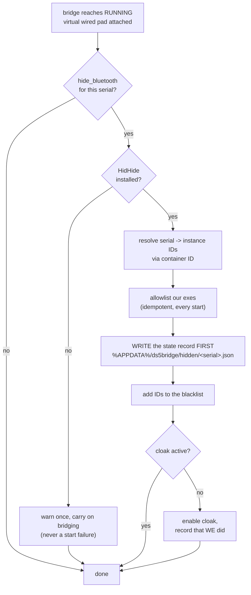
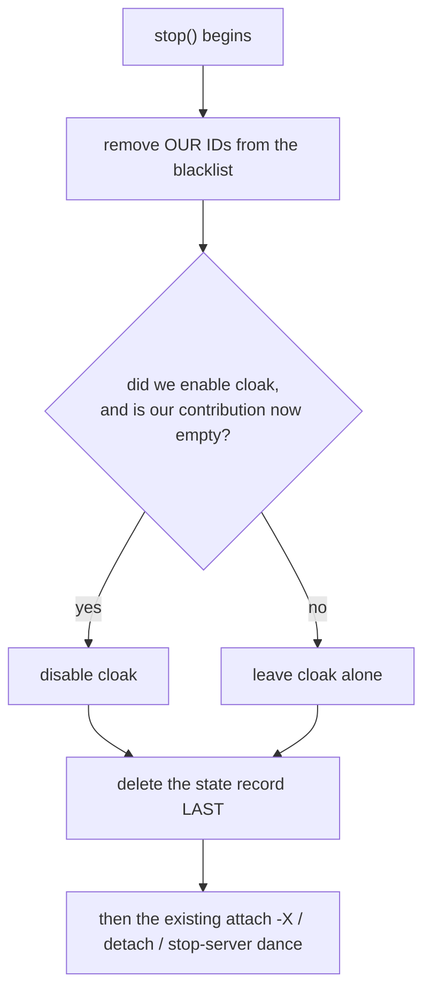

# Hiding the Bluetooth DualSense while it is bridged - scoping

Status: **IMPLEMENTED AND VERIFIED ON HARDWARE (2026-08-27).** H0 was run,
HidHide 1.5.230 is installed on the development machine, phases H1-H4 have
shipped behind a per-controller toggle that defaults to OFF, and both halves of
the premise now pass on the real controller: a non-whitelisted process stops
seeing the Bluetooth pad, and ds5bridge can still open it. The rest of H5 (Q4
RawInput/Steam, Q5 reconnect, Q6 packaging, Q7 usbip coexistence, Q9 cost, Q11
two controllers) is still outstanding.

Read **finding 5** below before touching the whitelist code: granting failed for
two full rounds of hardware testing, the cause was `sys.executable` not being
the process image path, and the guard that now catches it is a read-back rather
than a return value.

The body of this document below section 0 is the **original scoping text, left
as written**, so that the reasoning can be compared against what the hardware
turned out to do. Where the two disagree, the code and the H0 results win, and
the disagreements are called out inline.

---

## H0 results - what the hardware said

Run 2026-08-25 on the development machine: Windows 11 25H2, build 26200.

**Installed:** `HidHide_1.5.230_x64.exe`, downloaded from the official
`nefarius/HidHide` GitHub release `v1.5.230.0`, SHA-256
`F4BBBCB82E6258641B887C74BC81C4C5F66E4AA811808DFC304347687B7605F6`,
Authenticode signature valid and signed by *Nefarius Software Solutions e.U.*
Installed silently with `/quiet /norestart`, exit code 0. The driver
(`HidHide.sys`, file version 1.4.181.0 inside the 1.5.230 package) loaded
without a reboot and `UpperFilters` on `HIDClass` now contains `HidHide`.

> **Uninstall it only with its own uninstaller** -
> `MsiExec.exe /X{01E0AB21-D1CC-42B4-9DFF-84FFE4F26DAF}`, or Settings > Apps.
> Force-removing the driver in Device Manager leaves the `UpperFilters` entries
> behind, and **every HID device on the machine then fails to start** - no
> keyboard, no mouse, recoverable only by a registry edit from the Windows
> Recovery Environment.

**The machine has not been rebooted since the install.** HidHide's own setup
guide requires one, and finding 2 below is most likely a consequence of that.

| # | question | answer |
|---|---|---|
| **Q1** | Does HidHide 1.5.230 work on build 26200? | **Yes.** Issue #215 does **not** reproduce. `HidHideCLI.exe --version`, `--cloak-state`, `--app-list`, `--dev-list`, `--dev-gaming` all returned exit 0 with correct data, repeatedly. `--app-list` internally calls `GetWhitelist()`, which is the exact call #215 reports failing. |
| **Q2** | Real instance ID, and how many HID interfaces share the container? | The BT DualSense `a0fa9c0dd8bb` is `HID\{00001124-0000-1000-8000-00805f9b34fb}_VID&0002054c_PID&0ce6\8&110fb383&11&0000`, base container `BTHENUM\{...}_VID&0002054C_PID&0CE6\7&16440032&0&A0FA9C0DD8BB_C00000000`, and `baseContainerDeviceCount` is **1** - a Bluetooth DualSense exposes exactly one HID interface. Container-wide hiding (5.3) is therefore correct but currently a no-op for this hardware; it still matters for the USB case, where the same pad appears as `HID\VID_054C&PID_0CE6&MI_03`. |
| **Q8** | Does the IOCTL path work where the CLI does not? | Moot in the direction the document expected, and interesting in the other. See finding 2. |
| **Q10** | Can a non-elevated process hide/unhide? | **Not answered.** Both attempts (a SAFER basic-user token and a genuine medium-integrity scheduled task) failed with ERROR_FILE_NOT_FOUND - but so did an *elevated* attempt minutes later, so this measured finding 2, not a privilege boundary. Still open. |

### Finding 1 - the registry read surface does not exist

`HKLM\SYSTEM\CurrentControlSet\Services\HidHide\Parameters` has an **empty
DACL**. Reading it fails with `ERROR_ACCESS_DENIED` even from an elevated
process; `Get-Acl` returns no access entries at all.

So **section 3's option C is dead** - "read the lists from the registry as the
#215 workaround, and as `doctor`'s source of truth" is not available on this
build. It is not implemented. The service key itself
(`...\Services\HidHide`, without `\Parameters`) *is* world-readable, and that
is what `hidhide._driver_installed()` uses for detection instead.

### Finding 2 - the control device comes and goes

Immediately after the install, `\\.\HidHide` opened and every released IOCTL
answered correctly. Minutes later, the same call from the same elevated process
failed with `ERROR_FILE_NOT_FOUND (2)`, and the interface path
`\\?\ROOT#SYSTEM#0007#{0c320ff7-bd9b-42b6-bdaf-49feb9c91649}` failed with
`ERROR_INVALID_FUNCTION (1)` - for **every** combination of access mask
(`0`, `GENERIC_READ`, `GENERIC_WRITE`, both) and share mode (exclusive, R, RW).
Throughout, the devnode reported `CM_PROB_NONE` ("working properly"), the SCM
reported the service Running, and `HidHideCLI.exe` kept working perfectly.

This is most likely the pre-reboot state. But "most likely" is not something to
build on, so the design conclusion is the one that is correct either way:

> **Try the IOCTL, fall back to the CLI, and re-decide on every single call.**
> Nothing caches "the IOCTL works", because this machine demonstrates that
> answer changing underneath a running process.

This *inverts* section 3's recommended ordering in practice - the CLI is the
reliable surface here and the IOCTL is the optimisation - but it does not change
the code, because both backends ship and the fallback is automatic. What it
changes is that the CLI fallback is **load-bearing rather than theoretical**,
and is tested as such.

### Finding 3 - the install path is not in the registry

Section 2.6 expected `HKCR\SOFTWARE\Nefarius Software Solutions e.U.\...\Path`
and `HKCR\Installer\Dependencies\NSS.Drivers.HidHide.x64\Version`. **Neither
key exists** for 1.5.230 installed from the official installer - not in HKLM,
not in HKCU, not in either registry view. `find_cli()` therefore probes the
well-known Program Files locations and relies on the new `hidhide_cli` config
key as the escape hatch, which makes that key more load-bearing than section
6.3 assumed.

### Finding 4 - the filter only attaches to HID stacks built AFTER the install

A live hide/unhide was run against the real pad `a0fa9c0dd8bb`. The first
attempt set the blacklist and the cloak correctly, and **the pad stayed
perfectly visible**. Restarting only that one devnode
(`pnputil /restart-device HID\{00001124-...}\8&110fb383&11&0000`) and repeating
the test made it work immediately:

```
BT DualSense serials BEFORE:        ['a0fa9c0dd8bb']
BT DualSense serials WHILE HIDDEN:  []
BT DualSense serials AFTER:         ['a0fa9c0dd8bb']
```

So `UpperFilters` is a *class* registration: HidHide only gets into a device's
stack when that stack is (re)built. Every HID device that existed before the
install is unfiltered until a reboot. **The user guide's "and reboot" is
load-bearing, not boilerplate.**

This also answers **Q3's hidapi half: yes.** A non-whitelisted process's
`hid.enumerate()` stops returning the pad entirely, exactly as section 2.2
predicted from hidapi's open-to-read-strings behaviour.

### Finding 5 - the WHITELIST did not grant access - **our bug, now fixed**

The other half of the premise failed: with the pad hidden and
`prototype\.venv\Scripts\python.exe` on the whitelist, that interpreter still
could not see or open the controller. It survived a reboot, which ruled out the
explanation everyone reaches for first.

**The control experiment settled it.** `HidHideCLI.exe` is whitelisted by
default, and `--dev-gaming` reports `vendor` / `product` / `serialNumber`, which
come from `HidD_GetManufacturerString` and friends and therefore need an **open
handle** (`present` comes from SetupDi and proves nothing). With the pad hidden
and the cloak on:

```
BEFORE (visible) : present=True vendor='Sony Interactive Entertainment' serial='a0fa9c0dd8bb'
WHILE HIDDEN     : present=True vendor='Sony Interactive Entertainment' serial='a0fa9c0dd8bb'
```

HidHideCLI read straight through its own cloak. **Granting works fine at the
driver level.** The fault was ours.

**Root cause: `sys.executable` is not the process image path.** A Windows venv's
`Scripts\python.exe` is not an interpreter - `python -m venv` installs
`venvlauncher.exe` under that name, and in redirect mode it reads `pyvenv.cfg`
and runs the base interpreter as a **separate child process**:

```
pid 28972  ParentPid 29104  D:\...\prototype\.venv\Scripts\python.exe    <- the shim
pid 12788  ParentPid 28972  C:\...\pyenv-win\versions\3.12.5\python.exe  <- runs our code
```

`sys.executable` reports the shim in both processes, because the launcher
arranges it that way. But HidHide matches the **requesting process's image
path**, and its whitelist is **not inherited by children** - section 6.7 says
this in its own words and the implementation still walked into it. So we
registered a launcher that never opens a HID device, while the process that
actually calls `hid.enumerate()` stayed unwhitelisted and was blocked exactly as
designed.

Every earlier check had been consistent with this and none of them could see it:
the DOS -> NT conversion was correct, `HidHideCLI --app-reg` produced a
byte-identical entry, and a freshly started process was still blocked - because
in every one of those tests the path under examination was the wrong path.

**The fix** is `hidhide.current_image_path()`: ask the kernel with
`QueryFullProcessImageNameW(GetCurrentProcess())` and whitelist *that*, first,
ahead of `sys.executable`. It is correct for every shimmed interpreter - a venv,
pyenv-win, `py.exe`, Store Python, a `uv` venv - without enumerating them, and
correct for the frozen builds too. `sys._base_executable` is added as a belt to
its braces. After the fix, on the rebooted machine:

```
[1/2] blocking : PASS      (a non-whitelisted process stops seeing the pad)
[2/2] granting : PASS      (open result: opened)
BOTH HALVES PASS -- the feature is safe to switch on.
```

**The guard that makes this class of bug self-reporting:**
`HidHide.whitelist_covers_us()` reads the whitelist back and checks it contains
our *real* image, and `hide_for_bridge()` **refuses to hide** when the answer is
a definite no. `allow()` had reported success throughout the failure - a write
that succeeds is not evidence that the driver holds what you meant - so the
check is a read-back, and it is one list read at bridge start. An *unknown*
answer (unreadable whitelist) still proceeds, or a CLI-only install could never
hide anything.

Two loose ends that turned out not to matter: the installer did not register the
`HidHideWatchdog` service, though `HidHideWatchdog.exe` is on disk, and it was
never needed; and the whitelist inversion flag was `--inv-off` throughout, as it
must be - this project never touches it.

### Additional confirmations

* **The session blacklist is genuinely absent** from 1.5.230: IOCTLs 2056 and
  2057 both return `ERROR_INVALID_PARAMETER`. Section 2.5's plan to re-check on
  every release stands; H6 remains available.
* **The BOOLEAN IOCTLs need a one-byte buffer.** `IOCTL_GET_ACTIVE` with a
  1-byte output buffer succeeds; with a 4-byte (`sizeof(BOOL)`) buffer it fails
  with `ERROR_INVALID_PARAMETER`, and the zero-length size probe that the
  `MULTI_SZ` calls require is itself invalid here. Writing the obvious thing is
  writing the wrong thing; `hidhide.IoctlBackend.active()` documents it.
* **ViGEm Bus Driver is also installed** on this machine and coexists with
  HidHide without incident so far.

---

## 0. TL;DR

**Recommendation: build it, behind a per-controller toggle that defaults to OFF,
on HidHide's persistent blacklist, driven from Python by `ctypes` +
`DeviceIoControl` with `HidHideCLI.exe` as a fallback - but gate the whole thing
behind a one-day spike that proves HidHide works at all on this machine's
Windows build.**

Four things decide it:

1. HidHide is the only mechanism that hides a HID device from *other* processes
   while leaving it open to *ours*. Every alternative (device disable, exclusive
   open, unpair) either needs the device to be unusable by everybody - including
   the bridge, which must keep reading it - or is not possible on Windows at all
   (section 9).
2. The control surface is small and completely reachable from Python: one
   control device (`\\.\HidHide`), eight IOCTLs, two `REG_MULTI_SZ` values. No
   .NET, no COM, no new Python dependency (section 3).
3. The crash-safety problem is real but has a clean answer, because the failure
   is *observable at next startup*: a crash-proof record of what we hid, an
   unconditional unhide sweep on every start, plus a panic item in the tray and
   a CLI verb. This is the same shape as the existing
   `service.cleanup()` / `ds5bridge cleanup` rescue path, and should reuse its
   idioms (section 7).
4. The blocking risk is not design, it is **whether HidHide 1.5.230 - the newest
   published installer, from May 2024 - functions on Windows 11 25H2 (build
   26200), which is this development machine.** HidHide issue #215 reports the
   config UI and CLI failing on exactly that build across every driver version
   from 1.2.98.0 to 1.5.230.0, unresolved. Newer tags (v1.6.x, v1.7.x) exist in
   git but **no installer has been published for them** (section 4).

If the spike in section 10 (Q1) fails, the honest fallback is section 9's
"do nothing, document it", which is what `docs/USER-GUIDE.md` already does.

---

## 1. The problem

While a controller is bridged, Windows has two DualSenses:

| | devnode | who sees it |
|---|---|---|
| the real one | `HID\{00001124-...}_VID&0002054C_PID&0CE6\9&...` under `BTHENUM` | everything |
| the virtual one | `USB\VID_054C&PID_0CE6\...` under `ROOT\USB\0000` | everything |

`docs/USER-GUIDE.md` already documents the consequence in its troubleshooting
table:

> **The game sees TWO controllers** - the real Bluetooth one *and* the virtual
> wired one. Expected - Windows sees both. Most games take the wired one. If
> yours does not, unpair the Bluetooth controller from the *game's* settings,
> not from Windows.

That row is the current shipping answer, and it is a real answer for most
titles. The cases it does not cover:

* games and launchers that enumerate every gamepad and assign both to player
  slots, so one physical controller drives two players;
* games that prefer the *first* device enumerated rather than the wired one, and
  enumeration order is not stable (`app/ds5app/manager.py` documents this for
  our own enumeration; the same is true of the game's);
* tools such as `dualsense-tester` that open whichever DualSense they find and
  can therefore fight the bridge for the Bluetooth link;
* Steam Input, which reads the physical pad directly and can double up with
  whatever the game does with the virtual one.

Note what is *not* the problem. The bridge itself is unaffected - it holds the
Bluetooth HID handle and keeps working. This is purely about what everything
else can see.

---

## 2. How HidHide works

Verified from the project's own docs, source and issue tracker (section 12).

### 2.1 Shape

HidHide is a **kernel-mode upper filter driver on the HID device classes**,
installed as an `UpperFilters` entry on `HIDClass`, `XboxComposite` and
`XnaComposite` (this is confirmed by the official "fixing a bricked system"
page, whose recovery procedure is to delete exactly those three `UpperFilters`
values). It ships with:

* the filter driver (`HidHide.sys`), Microsoft-attestation-signed - no
  test-signing, same posture as usbip-win2;
* `HidHideClient.exe`, a GUI configuration client;
* `HidHideCLI.exe`, a scriptable client with the same capabilities;
* a small watchdog Windows service (added in 1.4.186).

### 2.2 The filtering rule

The interception point is **`IRP_MJ_CREATE`** - i.e. `CreateFile` on a HID
device interface. `OnDeviceFileCreate` is the gate. The driver takes the
requestor's PID (`WdfRequestGetRequestorProcessId`), maps it to a full image
path from a tree it maintains via `OnSystemLoadImage`, and:

```
if device is on the blacklist AND requesting image is NOT on the whitelist:
        fail the create
else:
        pass it through
```

Three consequences that matter to this design:

* **It blocks opening, not enumerating.** The devnode still exists; `SetupDi*`
  still lists it. In practice this still removes the device from
  `hid.enumerate()`, because hidapi's Windows `hid_enumerate` opens each
  interface to read its strings and skips any it cannot open - but that is an
  implementation detail of hidapi, not a guarantee from HidHide. Anything that
  reads input by a path that does not involve `CreateFile` on the HID interface
  (RawInput being the obvious candidate) is **not** covered by this reasoning
  and needs testing (Q4).
* **Already-open handles are unaffected.** Hiding a device does not evict a
  game that already has it open. So hiding has to happen *before* the game
  starts, and the tray toggle will look like it did nothing if flipped mid-game.
  That must be said in the UI text.
* **Whitelist changes take effect immediately** - the driver flushes its
  per-process evaluation cache (`HidHideProcessIdsFlushWhitelistEvaluationCache`)
  when the whitelist changes. No reboot, no replug, for configuration changes.

### 2.3 The three pieces of state

| | contents | registry value under `HKLM\SYSTEM\CurrentControlSet\Services\HidHide\Parameters` |
|---|---|---|
| device blacklist | device **instance IDs**, as returned by `SetupDiGetDeviceInstanceId` | `BlacklistedDeviceInstancePaths` (`REG_MULTI_SZ`) |
| application whitelist | **full image names** - volume-relative NT paths, e.g. `\Device\HarddiskVolume3\Program Files\...\x.exe` | `WhitelistedFullImageNames` (`REG_MULTI_SZ`) |
| active flag ("cloak") | global on/off for the whole filter | `Active` (DWORD) |

A fourth flag inverts the whitelist into a blocklist (`--inv-on` / `--inv-off`).
**This project must never touch it** - it is global and would change the
behaviour of every other HidHide consumer on the machine.

All three persist in the registry, which is the crux of section 7: **hiding
survives a reboot, a crash, a power cut and an uninstall of our app.** Nothing
expires on its own.

### 2.4 The control device and its IOCTLs

User mode talks to the driver by `CreateFile` on `\\.\HidHide` (or through the
interface GUID `{0C320FF7-BD9B-42B6-BDAF-49FEB9C91649}`). Per the API docs, no
elevation is required and elevation "should be avoided". **Only one process may
hold the control device open at a time** - this is an explicit constraint and it
shapes the design (section 6.4).

Control codes are `CTL_CODE(32769, N, METHOD_BUFFERED, FILE_READ_DATA)`, i.e.
`0x80010000 | 0x4000 | (N << 2)`:

| name | N | value | payload |
|---|---|---|---|
| `IOCTL_GET_WHITELIST` | 2048 | `0x80016000` | `MULTI_SZ` out |
| `IOCTL_SET_WHITELIST` | 2049 | `0x80016004` | `MULTI_SZ` in |
| `IOCTL_GET_BLACKLIST` | 2050 | `0x80016008` | `MULTI_SZ` out |
| `IOCTL_SET_BLACKLIST` | 2051 | `0x8001600C` | `MULTI_SZ` in |
| `IOCTL_GET_ACTIVE` | 2052 | `0x80016010` | `BOOLEAN` out |
| `IOCTL_SET_ACTIVE` | 2053 | `0x80016014` | `BOOLEAN` in |
| `IOCTL_GET_WLINVERSE` | 2054 | `0x80016018` | `BOOLEAN` out |
| `IOCTL_SET_WLINVERSE` | 2055 | `0x8001601C` | `BOOLEAN` in |

The list IOCTLs are whole-list replace, not add/remove: **every change is a
read-modify-write**, and that is the single most dangerous property of this API
for us. If two processes do it concurrently, one loses. See section 6.4.

Buffer rules, verbatim from `DEVELOPER.md`: list payloads are `MULTI_SZ` -
"a sequence of null-terminated wide-character strings with an additional null
terminator to close the list" - and the buffer size passed to `DeviceIoControl`
"must be an even number of bytes and include all terminators". Get calls are
size-probed first (call with a zero-length buffer, read the required size).

### 2.5 The session blacklist - the feature we want, that is not released yet

`DEVELOPER.md` on `master` documents functions **2056/2057** (`0x80016020` /
`0x80016024`), a *session blacklist* for "feeder applications - programs that
exclusively own one or more physical devices and re-expose them as virtual
controllers". That is a literal description of this project. Its entries:

* live only in kernel memory - **never written to the registry**;
* are owned by the process that set them;
* are removed automatically when that process exits, via
  `PsSetCreateProcessNotifyRoutine`;
* need no cleanup on exit, which "eliminates rollback complexity and provides
  inherent safety against unexpected termination".

This would delete section 7 of this document entirely.

**It is not in any published release.** Checked directly against the source at
tag `v1.5.230.0`: `HidHideCLI/src/FilterDriverProxy.cpp` defines exactly the
eight IOCTLs 2048-2055 and no more. The session blacklist exists only on
`master`, and `master` has no installer.

So: design for the persistent blacklist, keep the module's interface narrow
enough that swapping in the session blacklist later is a change to one function,
and re-check on every HidHide release.

### 2.6 The CLI

`HidHideCLI.exe` verbs (from `HidHideCLI/src/Commands.cpp`):

| verb | argument | effect |
|---|---|---|
| `--app-list` | - | list whitelisted applications |
| `--app-reg` | app path | add to the whitelist |
| `--app-unreg` | app path | remove from the whitelist |
| `--app-clean` | - | drop whitelist entries whose file no longer exists |
| `--dev-all` | - | JSON list of all HID devices |
| `--dev-gaming` | - | JSON list of gaming HID devices |
| `--dev-list` | - | list blacklisted device instance paths |
| `--dev-hide` | instance path | add to the blacklist |
| `--dev-unhide` | instance path | remove from the blacklist |
| `--cloak-on` / `--cloak-off` / `--cloak-toggle` / `--cloak-state` | - | the global active flag |
| `--inv-on` / `--inv-off` / `--inv-state` | - | whitelist inversion (do not touch) |
| `--cancel`, `--help`, `--version` | - | |

The CLI does the read-modify-write for us, which is its main attraction. Its
install location is discoverable from
`HKCR\SOFTWARE\Nefarius Software Solutions e.U.\Nefarius Software Solutions e.U. HidHide\Path`,
with the installed version at
`HKCR\Installer\Dependencies\NSS.Drivers.HidHide.x64\Version`.

Note that the clients auto-whitelist themselves on startup, so the whitelist on
a machine with HidHide installed is never empty.

---

## 3. Control surface: what we would actually call from Python

Three options, and they are not exclusive.

### A. Shell out to `HidHideCLI.exe`

* Pro: least code; the CLI owns the read-modify-write and the path conversion
  (DOS path -> full image name); trivially testable by mocking `subprocess.run`;
  identical to what every other project in this ecosystem does.
* Pro: matches the existing `app/ds5app/usbip.py` pattern exactly - this repo
  already shells out to `usbip.exe` and has the idioms for locating an exe,
  parsing its output and reporting a missing install as an actionable message.
* Con: a process spawn per operation (tens of ms - irrelevant, these happen at
  bridge start/stop, not on the input path).
* Con: **it is the component that issue #215 reports as crashing on Windows 11
  25H2**, because its `FilterDriverProxy` constructor calls `GetWhitelist()`
  before doing anything else and that call returns `ERROR_INVALID_PARAMETER`.
  If that reproduces here, every CLI verb is unusable, including `--dev-unhide`,
  including the panic path.

### B. `ctypes` + `DeviceIoControl` against `\\.\HidHide`

* Pro: no dependency on the CLI at all, and about 150 lines of `ctypes` -
  `CreateFileW`, `DeviceIoControl`, `MULTI_SZ` pack/unpack. This codebase
  already does exactly this class of thing (`manager.create_kill_on_close_job`,
  `service.InstanceLock`), so it is in keeping.
* Pro: **it can route around #215 if the fault is confined to `GET_WHITELIST`.**
  We need the current lists only to do the read-modify-write; those lists are
  also readable straight from the registry
  (`BlacklistedDeviceInstancePaths` / `WhitelistedFullImageNames`), which needs
  no IOCTL at all. If `SET_*` works and only `GET_*` is broken, "read the
  registry, write via IOCTL" is a viable client. **This is a hypothesis, and
  Q1/Q8 in section 10 is the experiment that decides it.**
* Con: we own the read-modify-write, and therefore the concurrency (6.4).
* Con: we own the DOS-path -> full-image-name conversion for whitelist entries
  (`\??\C:\...` -> `\Device\HarddiskVolumeN\...` via `QueryDosDeviceW` on the
  drive letter). Small, but a place to get it subtly wrong.

### C. Write the registry directly and let the driver reload

* Pro: no IOCTL, no CLI.
* Con: needs administrator rights (HKLM), which the tray is deliberately not.
* Con: the driver caches; a registry write without the corresponding IOCTL may
  not take effect until a reboot or a driver restart.
* Verdict: **read-only use only** - as a source of truth for "what is currently
  hidden", for `doctor`, and as the #215 workaround in B. Never write it.

**Recommendation: B for writes, C for reads, A as a runtime-detected fallback.**
Ship a single `app/ds5app/hidhide.py` with a backend-neutral interface so that
which one is in use is a detail:

```python
class HidHide:
    @staticmethod
    def detect() -> "HidHide | None": ...      # None == not installed
    def version(self) -> str: ...
    def hidden(self) -> list[str]: ...          # blacklist, as instance IDs
    def allowed(self) -> list[str]: ...         # whitelist, as DOS paths
    def hide(self, instance_ids: list[str]) -> None: ...
    def unhide(self, instance_ids: list[str]) -> None: ...
    def allow(self, exe_paths: list[str]) -> None: ...
    def active(self) -> bool: ...
    def set_active(self, on: bool) -> None: ...
```

Every method must be idempotent and must never raise past the caller for a
missing install - the same contract `config.load()` holds, and for the same
reason: a HidHide problem must never be why the tray icon does not appear.

---

## 4. Installation story

HidHide is a **separately installed, separately signed kernel driver**, exactly
like usbip-win2 already is for this project. That is a comfortable precedent -
`docs/USER-GUIDE.md` step 1 is already "go and install somebody else's signed
driver, because a game utility should not push a driver onto your machine behind
your back". A second such step is not a new kind of ask.

| | |
|---|---|
| Newest **published** installer | **1.5.230.0**, `HidHide_1.5.230_x64.exe`, 11 May 2024 |
| Newest **git tags** | v1.6.295/297 (Sep 2025), v1.7.333/339/344/346 (Apr-May 2026) - **no published release or installer for any of them** |
| Platforms | Windows 10/11, x64 Intel/AMD. No 32-bit. ARM64 exists only as a manual `nefcon` ZIP install. |
| Reboot | **Yes, required.** The setup guide says so plainly. Installing adds `UpperFilters` on the HID classes, which is a class-wide change. |
| Elevation | Installing needs admin. *Using* the control device does not, and per the API docs should not be elevated. |
| winget | `winget install -e --id Nefarius.HidHide` (tracks 1.5.230) |
| Hard incompatibility | **HidHide and HidGuardian must not both be installed.** |
| Known conflict | Kaspersky Anti-Virus interferes with whitelisting, because of how it does process detection. |

### Coexistence with usbip-win2

No conflict is expected, and the reason is structural: HidHide filters
`HIDClass`/`XboxComposite`/`XnaComposite`, while usbip-win2 provides a UDE host
controller under `ROOT\USB\0000`. They meet only in that a device attached
through usbip-win2 eventually binds `HidUsb` and therefore acquires a HidHide
filter instance like every other HID device - which is fine, because we never
blacklist the virtual device. Confirm on hardware anyway (Q7): both drivers
restart large swathes of the device tree during install (usbip-win2 restarts
every USB 3.0 hub, HidHide restarts every HID device), so **install them one at
a time, reboot between, and take a restore point** - the same advice the README
already gives for usbip-win2 alone.

### Uninstall hazard, worth repeating to users

Removing the HidHide driver by deleting it in Device Manager, rather than
through its uninstaller, **leaves the `UpperFilters` entries behind and every
HID device on the machine then fails to start** - no keyboard, no mouse. The
recovery is a Windows Recovery Environment registry edit. Our docs must say
"uninstall it with its own uninstaller" in the same breath as "install it".

---

## 5. Finding the device instance path for a given controller

This is the piece with the most room to get wrong, and the one place where our
existing data does not line up with HidHide's.

### 5.1 What we have vs what HidHide wants

`prototype/ds5bridge/device.py` gets a hidapi **device interface path**:

```
\\?\HID#{00001124-0000-1000-8000-00805f9b34fb}_VID&0002054c_PID&0ce6#9&28da590b&0&0000#{4d1e55b2-f16f-11cf-88cb-001111000030}
```

HidHide wants a **device instance ID**, the `SetupDiGetDeviceInstanceId` form:

```
HID\{00001124-0000-1000-8000-00805F9B34FB}_VID&0002054C_PID&0CE6\9&28DA590B&0&0000
```

They are close enough to be tempting and different enough that string surgery on
the interface path (swap `\\?\` for nothing, `#` for `\`, drop the trailing
interface GUID) is a trap: it happens to work for this shape today and silently
produces a non-matching entry the day a container ID or a `&Col02` suffix moves.
**Ask Windows.**

### 5.2 The supported call

`CM_Get_Device_Interface_PropertyW(interface_path, &DEVPKEY_Device_InstanceId,
...)` - one call, no handles to leak, no `SetupDi` device-info-set lifetime to
manage. `DEVPKEY_Device_InstanceId` is
`{78c34fc8-104a-4aca-9ea4-524d52996e57}, 256`, type `DEVPROP_TYPE_STRING`.

`cfgmgr32.dll` is in `System32`, callable straight from `ctypes`. Call once with
a zero size to get the required buffer, then again.

The alternative (`SetupDiGetClassDevs(&GUID_DEVINTERFACE_HID, ...,
DIGCF_DEVICEINTERFACE)` -> `SetupDiEnumDeviceInterfaces` ->
`SetupDiGetDeviceInterfaceDetail` -> `SetupDiGetDeviceInstanceId`) gets the same
answer with more state to manage. Prefer `CM_*`.

### 5.3 Hide every interface of the controller, not just the gamepad one

`enumerate_devices()` in `prototype/ds5bridge/device.py` filters on
`usage_page == 0x01 / usage == 0x05`, i.e. it deliberately looks at only one
collection. Anything hidden on that basis alone leaves the controller's other
HID collections open, and a tool that opens a different collection still finds
the pad.

The right unit is the **device container**. Read
`DEVPKEY_Device_ContainerId` (`{8c7ed206-3f8a-4827-b3ab-ae9e1faefc6c}, 2`) for
our device, then blacklist every HID device instance sharing that container ID.
This is what HidHide's own GUI does - it groups by Base Container ID precisely
so that "hide this controller" hides all of its interfaces.

Do **not** blacklist the `BTHENUM` parent. HidHide filters the HID classes; a
Bluetooth enumerator devnode is not one of them, and an entry that matches
nothing is dead weight that a future reader will misinterpret. Resolve the
parent chain (`CM_Locate_DevNodeW` -> `CM_Get_Parent` -> `CM_Get_Device_IDW`)
for **diagnostics only** - it is genuinely useful in `doctor` output and in bug
reports, because it is where the bdaddr appears in plain text.

### 5.4 The instance path is not stable across re-pairing

HidHide discussion #63 is this exact hardware: unpair and re-pair a DualSense
over Bluetooth and the instance ID changes - a user reported
`...9&1a03a06a&18&0000` becoming `...9&1a03a06a&17&0000` - and the old blacklist
entry stops matching. The maintainer's answer is that this is Windows' design
and there is no way around it.

Two design rules follow, and they are not optional:

1. **Never treat a stored instance path as the controller's identity.** The
   identity is the bdaddr serial, as it is everywhere else in this codebase.
   Resolve serial -> instance paths fresh at every hide.
2. **A stored path is only ever a cleanup token** - "we put this string in the
   blacklist, take it back out". Removing a stale entry is harmless.

A corollary for `doctor`: report any blacklist entry we recorded that no longer
corresponds to a present device, so a user who re-paired can see the litter.

---

## 6. Proposed design

### 6.1 Where it lives

* `app/ds5app/hidhide.py` - **new**, the only file that knows what HidHide is.
  Detection, instance-path resolution, hide/unhide/allow, all idempotent, all
  non-raising. No imports outside the standard library (same rule as
  `config.py`), so `doctor` can report on it on a machine where hidapi is
  broken.
* `app/ds5app/service.py` - `BridgeService` gains a hide step in
  `_start_inner()` after step 7 and an unhide step in `stop()` before the
  detach. Putting it here rather than in the manager means **one code path** for
  the tray, `ds5bridge --all` and a bare `ds5bridge run`, which is the same
  argument `manager.default_child_command()` already makes for reusing
  `ds5bridge run`.
* `app/ds5app/tray.py` - a per-controller submenu, plus one panic item.
* `app/ds5app/config.py` - new keys (6.3).
* `app/ds5app/cli.py` - `ds5bridge unhide`, and new `doctor` rows.

### 6.2 Lifecycle



Teardown is the exact reverse, and runs from `BridgeService.stop()`:



Two orderings above are load-bearing:

* **Record before hiding, delete after unhiding.** A crash in the window between
  them leaves a record of something that is not hidden, and the sweep's unhide of
  an already-absent entry is a no-op. The opposite order leaves something hidden
  with no record of it - which is the one outcome that strands the user.
* **Unhide before detaching, not after.** If the unhide throws, we have not yet
  begun tearing the virtual device down, so the failure is recoverable and
  reportable while the bridge is still coherent.

Both hide and unhide must be wrapped so that **a HidHide failure can never fail
a bridge**. Hiding is a convenience; bridging is the product.

### 6.3 Config keys

Per controller, in `ControllerConfig` (add to `_CC_KNOWN`):

```json
"controllers": {
  "d42f4ba1485d": {
    "enabled": true,
    "audio_target": "speaker",
    "port": 3241,
    "label": "",
    "hide_bluetooth": false
  }
}
```

Top level, in `Config` (add to `_CFG_KNOWN`):

```json
"hide_bluetooth_default": false,
"hidhide_cli": null
```

`hide_bluetooth_default` seeds new controllers the way `auto_bridge_new` seeds
`enabled`. **It ships `false`**, so the first release changes nothing for anyone
who does not go looking, which is the right default for a feature whose failure
mode is an invisible controller. `hidhide_cli` is an escape hatch for a
non-standard install location, mirroring the existing `--usbip` flag.

`config.py`'s `extra` passthrough means an older build opening a newer config
preserves these untouched, which is already the documented contract.

**The runtime state does not go in `config.json`.** See 6.5.

### 6.4 The concurrency constraint

Two facts collide:

* only one process may hold `\\.\HidHide` open at a time;
* every list change is a read-modify-write, so two concurrent changers lose an
  entry.

With `--all` and two controllers, this repo runs **two child processes** that
would both want to hide. Options:

1. **Serialize with a named mutex.** `Local\ds5bridge-hidhide`, acquired around
   every open/modify/close of the control device, released immediately after.
   `service.InstanceLock` is already this exact object and can be generalised
   with a "wait, do not refuse" mode. Cheap, local, obvious. **Recommended.**
2. Route all HidHide calls through the manager (tray) process. Cleaner in
   theory; needs an IPC channel between parent and children that does not exist
   today, and breaks the "bare `ds5bridge run` gets the same behaviour" property.
3. Hold the control device open for the process lifetime. Rejected outright: it
   would lock out `HidHideClient.exe` and every other consumer on the machine
   for as long as we run, which is hostile.

Use `Local\`, not `Global\`, for the same reason `service.InstanceLock` does.
Note the honest limit: this only serialises *us*. If the user has
`HidHideClient.exe` open and clicking at the same moment, an entry can still be
lost - which is another reason the startup sweep (7.2) exists.

### 6.5 The state record

A directory, one small JSON file per bridged serial:

```
%APPDATA%\ds5bridge\hidden\d42f4ba1485d.json
{
  "serial": "d42f4ba1485d",
  "instance_ids": ["HID\\{00001124-...}_VID&0002054C_PID&0CE6\\9&28DA590B&0&0000"],
  "pid": 24188,
  "image": "ds5bridge.exe",
  "cloak_enabled_by_us": false,
  "written_at": "2026-08-25T17:20:11Z"
}
```

A directory of per-serial files, rather than a section in `config.json`,
because:

* N bridge children each own exactly one file, so there is no lost-update
  problem between them and none against the tray's own `config.json` writes;
* the sweep is a directory listing, which works even if `config.json` has been
  quarantined as `config.json.bad`;
* deleting the file is the commit point for "we are clean", and a single
  `os.remove` is as atomic as this needs to be.

Write with the same `.tmp` + `os.replace` + `fsync` dance `config.save()` uses,
for the same reason.

### 6.6 Tray UX

Per-controller rows currently toggle bridging directly. Turning them into
submenus would change a one-click interaction into two, which is a real cost for
the common case. Proposal:

* the controller row keeps its current click-to-toggle-bridging behaviour;
* one new item under the controller block:
  **`Hide Bluetooth pad while bridged`**, a checkbox that applies to the
  controller currently... - no. That is ambiguous with more than one pad.

Better, and consistent with `MAX_SLOTS`: **a second fixed bank of slots**, one
per controller, in a `Hide Bluetooth pad while bridged >` submenu:

```
ds5bridge -- 1 of 1 bridged
--------------------------------
[x] Bridging enabled
--------------------------------
[x] d42f..485d  250/s  70%
[ ] a0fa..d8bb  off
--------------------------------
    Hide Bluetooth pad while bridged  >   [ ] d42f..485d
                                          [ ] a0fa..d8bb
                                          -----------------
                                              Unhide everything now
--------------------------------
    Rescan for controllers
[ ] Start at login
    Quit
```

Rules:

* every item is a lambda over the latest snapshot; the menu object is still
  built exactly once - `tray.py`'s module docstring is explicit that rebuilding
  a menu somebody has open is a genuinely unpleasant bug, and this must not
  become the exception.
* the submenu is `visible=False` when HidHide is not installed. Not greyed out -
  an unexplained grey checkbox invites a support question. Instead show one
  disabled row: `HidHide is not installed`.
* **`Unhide everything now`** is visible whenever the `hidden/` directory is
  non-empty, *even when HidHide is not detected*, because that is exactly the
  state a user needs to escape.
* toggling a controller's hide flag while it is bridged applies immediately
  (hide or unhide now), and the notification says *"games started from now on
  will not see the Bluetooth pad"* - because already-open handles are unaffected
  (2.2).

Switching a pad back to native Bluetooth - unticking its bridging row, or the
master switch - goes through `BridgeManager.stop()` -> `ChildBridge.stop()` ->
`BridgeService.stop()`, which already contains the unhide. **The invariant is
"unhide is part of stop", not "unhide is part of the tray"**, so every path that
stops a bridge unhides: the tray toggle, the master switch, hotplug's
`vanish_grace` expiry, a child crash, Quit, Ctrl+C, and console close.

The one path that does *not* go through `BridgeService.stop()` is a hard kill of
the child - `ChildBridge.stop()` documents that `Popen.terminate()` runs no
atexit hook. That case is covered by section 7 and only by section 7.

### 6.7 Manager interaction - the oscillation trap

This is the sharpest integration risk in the whole design, and it is not
obvious.

`manager.enumerate_serials()` runs **in the tray process** every
`hotplug_interval` (5 s), and it calls `hid.enumerate()`. If the tray executable
is not on the HidHide whitelist, then the moment we hide a controller:

```
tray enumerates -> hidden -> serial not in `present`
    -> _missing_since set
    -> 30 s later (vanish_grace) -> "controller gone -- stopping its bridge"
    -> stop() -> unhide -> controller reappears
    -> "controller appeared -- starting" -> hide -> ...
```

A ~40-second self-sustaining flap that looks exactly like a flaky Bluetooth
link, on hardware where flaky Bluetooth links are a documented real failure
mode. It would cost a day to diagnose.

Two defences, and take both:

1. **Whitelist every executable of ours that opens or enumerates HID**, not just
   the one that holds the handle. That is `ds5bridge.exe` *and*
   `ds5bridge-tray.exe` (and the venv `python.exe` when running from source).
   The whitelist is not inherited by child processes - it is matched per image -
   so both are required.
2. **Belt and braces in `poll_once`:** treat a serial we have hidden as present.
   Note this is *not* the "skip the ones that are bridged" bookkeeping the
   manager's docstring rejects - that rejection is about not *probing* a bridged
   controller, and this adds no HID call at all. Keep it to a single explicit
   union with a comment pointing here.

---

## 7. Crash safety

The requirement, stated as an invariant:

> **A user must never be left with a controller they cannot use, whatever
> happens to our process.**

HidHide's persistent blacklist is registry state. It survives our crash, a
`taskkill /F`, a bugcheck, a power cut and a reboot. Nothing unhides on its own.
So "hide" is a debt, and this section is how it is always repaid.

### 7.1 Repayment paths, in order of how much they can be relied on

| when | mechanism | reliable? |
|---|---|---|
| normal stop | `BridgeService.stop()` (6.2) | yes |
| Ctrl+C, SIGTERM, console close, logoff | `service.install_crash_handlers()` -> `_teardown_all()` -> `stop()` | yes - already load-bearing for detach |
| unhandled exception | `atexit` via the same | yes |
| tray Quit | `mgr.close()` -> `stop_all()` -> per-child `stop()` | yes |
| child hard-killed / job object closes | nothing runs | **no** |
| bugcheck, power cut | nothing runs | **no** |

The last two rows are why the sweep exists. Note that this project already
accepts an identical residue for the microphone -
`ChildBridge.stop()`'s docstring says a hard kill means "the controller's
microphone is never disarmed and keeps draining until the next open re-primes
it". A hidden controller is the same class of debt with a much worse user-facing
symptom, so it gets a much stronger repayment.

### 7.2 The unhide sweep - the actual safety net

**On every process start, before anything else HidHide-related, and
unconditionally - including when the feature is switched off, including when no
controller is connected:**

```
for record in %APPDATA%\ds5bridge\hidden\*.json:
    if record.pid is alive AND process_name(record.pid) is one of ours:
        continue                     # a live sibling owns this; leave it alone
    unhide(record.instance_ids)      # idempotent; absent entries are a no-op
    if record.cloak_enabled_by_us and our contribution is now empty:
        set_active(False)
    delete the record
```

Properties this needs, all of them:

* **Runs from `ds5bridge.exe`, `ds5bridge-tray.exe` and `ds5bridge cleanup`
  alike.** Whichever one the user reaches for next, it fixes itself.
* **Liveness check, not a bare "unhide everything".** Without it, launching the
  tray while a `ds5bridge run` is bridging in a terminal would unhide that one's
  controller out from under it. `service.process_name(pid)` already exists for
  precisely this shape of question and already documents why the image *name* is
  used rather than the command line.
* **Never removes an entry we did not add.** The user may hide other pads with
  HidHide for DS4Windows; blowing those away would be a serious breach. Only
  instance IDs present in one of our records are ever removed. Corollary: the
  cloak flag is only ever turned off if we turned it on and nothing of ours is
  left hidden.
* **Silent on the happy path.** An empty directory is the normal case.

### 7.3 The explicit escapes

* **Tray: `Unhide everything now`** (6.6). One click, visible whenever the
  record directory is non-empty, and it runs the sweep with the liveness check
  skipped - this is the "I do not care what is running, give me my controller
  back" button. It should stop every bridge first, so the state is coherent
  afterwards.
* **CLI: `ds5bridge unhide`.** Same thing, from a terminal, for the case where
  the tray itself will not start. Also `ds5bridge unhide --all-hidhide` as a
  documented-but-loud last resort that clears every entry HidHide holds, with a
  printed warning naming the entries it is about to remove and requiring
  confirmation.
* **`ds5bridge cleanup` calls the sweep.** It is already the documented rescue
  verb ("undo a run that crashed", "safe to run any time, twice, or when nothing
  is up") and a user who has lost a controller will type it.
* **`ds5bridge doctor` reports it.** New rows: is HidHide installed and at what
  version; is the cloak active; how many devices are hidden by us; how many
  records exist; and, loudly, any record whose owning process is dead. `doctor`
  is what the user guide already tells people to paste into an issue.
* **The user's own escape, documented:** HidHide's own configuration client, or
  `HidHideCLI.exe --cloak-off`. Put this in `docs/USER-GUIDE.md` next to the
  feature, phrased as "if anything ever goes wrong, here is how to get your
  controller back without us".

### 7.4 Reboot behaviour

A record written before a bugcheck survives in `%APPDATA%`; the blacklist entry
survives in the registry. On the next launch the sweep matches them up and
unhides. If the tray autostarts at login (`config.autostart_on_login`), that
happens before the user reaches the desktop - which is the strongest argument in
this document for encouraging autostart when the hide feature is on.

The gap: a user who hides a pad, crashes, and then *uninstalls* our app is left
with a hidden pad and no tool. Mitigation is documentation, plus making
`doctor` and the user guide name HidHide's own client explicitly.

---

## 8. Packaging and install impact

* **No new Python dependency.** `ctypes` and `subprocess` only. The
  `hiddenimports` list in `app/packaging/ds5bridge.spec` gains
  `"ds5app.hidhide"` - it will be imported from inside function bodies, the same
  as `ds5app.manager`, `ds5app.config` and `ds5app.autostart` already are, and
  the spec's comment explains exactly why those are listed.
* **The spec is ONE-DIR by default** (`ds5bridge.spec` line 92 onward;
  `DS5_ONEFILE=1` switches to one-file "for comparison"). This matters for the
  whitelist: one-dir gives `...\ds5bridge\ds5bridge.exe` and
  `...\ds5bridge\ds5bridge-tray.exe`, stable paths that a user only invalidates
  by moving the folder.
* **One-file is expected to be fine too, but verify (Q6).** PyInstaller's
  one-file bootloader extracts *support files* to `%TEMP%\_MEIxxxxxx`; the
  process image is still the original `.exe`, and the bootloader's child process
  is spawned from that same path. Since HidHide matches on the process image
  path, the changing `_MEIxxxxxx` should be irrelevant. This is a reasoned
  expectation from how the bootloader works, not something observed - test it
  before claiming it.
* **Re-register the whitelist on every start.** It is idempotent and cheap, and
  it repairs the case the ecosystem hits constantly: HidHide keys on the
  absolute path, so moving or reinstalling the app silently invalidates the
  entry. Also call the equivalent of `--app-clean` (or filter entries whose file
  no longer exists) so the list does not accumulate one dead path per install
  location, forever.
* **Directory junctions break whitelisting** (HidHide issue #79 - a whitelisted
  path reached through a junction does not match). Resolve our own path with
  `os.path.realpath` before registering, and record what we registered.
* **Running from source** means whitelisting
  `<repo>\prototype\.venv\Scripts\python.exe`. Say plainly in `CONTRIBUTING.md`
  what that grants: *any* script run by that interpreter can then open hidden
  devices. It is the developer's own venv, so it is a defensible grant, but it
  should be a stated one rather than a silent one.
* **`docs/USER-GUIDE.md`** gains an optional step 3 (install HidHide, reboot,
  uninstall only via its own uninstaller) and a troubleshooting row for "my
  controller vanished from Windows" -> `ds5bridge unhide`.
* **`docs/provenance.md` / `ATTRIBUTIONS.md`**: HidHide is MIT-licensed and we
  would be *calling* it, not vendoring it - the same relationship the project
  already has with usbip-win2. A credit line, no NOTICE change.

---

## 9. Alternatives considered

### 9.1 Do nothing, and document game-side priority

What ships today. `docs/USER-GUIDE.md` already has the row, and it is honest:
most games prefer the wired pad. Cost: zero. Benefit: zero for the games that
get it wrong. **This remains the fallback if section 10's Q1 fails**, and it is
not a bad one - it should stay documented either way, because HidHide will
always be optional.

### 9.2 Disable the devnode (SetupAPI `DIF_PROPERTYCHANGE` / `DICS_DISABLE`, or `pnputil /disable-device`)

Rejected, and not merely because it is heavier.

* It needs administrator rights, which the autostarted tray deliberately does
  not have.
* **It would break the bridge.** A disabled devnode is gone for *everybody*,
  including us - and the bridge's entire job is to keep reading that Bluetooth
  pad. This is not a tuning problem; it is a contradiction. The same objection
  kills `CM_Query_And_Remove_SubTree`.
* Its failure mode is worse than HidHide's. A device left disabled after a crash
  needs Device Manager to fix, and the state lives in the device's own registry
  key rather than in one list we can enumerate.

### 9.3 Exclusive open

The idea: open the HID device with `dwShareMode = 0` so nothing else can.

It does not work on Windows. `HidClass` opens the underlying device
system-exclusively only for the system's own use (mice and keyboards); for
everything else, user-mode opens are shared and a zero share mode does not give
a user-mode process the exclusivity it implies. hidapi, in any case, opens with
`FILE_SHARE_READ | FILE_SHARE_WRITE` and exposes no way to ask for anything
else. There is no supported user-mode path to exclusive access to a HID device,
which is precisely the gap HidHide was written to fill.

### 9.4 Unpair the Bluetooth device while bridged

Rejected on sight. The bridge needs the Bluetooth link. It would also destroy
the pairing, which the project already refuses to touch on principle - the
README states that the reports which re-pair a controller or touch its firmware
"are deliberately blocked and never forwarded".

### 9.5 Per-title configuration (Steam controller settings, in-game bindings)

Zero code, and genuinely the right answer for some titles. Should be *mentioned*
in the user guide alongside the feature, not built.

### 9.6 Why HidHide is the right call

It is the only option that expresses the actual requirement - "hidden from
everyone except us" - and it is the same class of dependency the project already
took on knowingly: a separately installed, Microsoft-signed, third-party driver
from a maintained project that the surrounding ecosystem already depends on.
The reasons to hesitate are operational, not architectural: a second driver
install to explain, a real crash-safety obligation, and an unresolved
compatibility report on the exact Windows build this was developed on.

---

## 10. Open questions - all need hardware

| # | question | how to answer | blocks |
|---|---|---|---|
| **Q1** | **Does HidHide 1.5.230 work at all on Windows 11 25H2 (build 26200)?** Issue #215 reports `HidHideClient.exe`/`HidHideCLI.exe` failing at startup with `ERROR_INVALID_PARAMETER` from `GetWhitelist()`, on every driver version 1.2.98.0-1.5.230.0, unresolved. | Install on a machine with a restore point. Run `HidHideCLI.exe --cloak-state`. If it crashes, go to Q8. | everything |
| Q2 | What is the real instance ID of a BT DualSense here, and how many HID interfaces share its container? | `HidHideCLI --dev-all`, plus a `CM_Get_Device_Interface_Property` spike over `hid.enumerate()` output. | 5.3 |
| Q3 | Once hidden, does the pad actually disappear from `hid.enumerate()` in a non-whitelisted process, from `joy.cpl`, and from `dualsense-tester`? For dualsense-tester specifically: which Chrome process performs the WebHID open - the browser process or a utility process - and does whitelisting therefore behave as expected? | Direct observation with a non-whitelisted Python, `joy.cpl`, and the tester. | the whole premise |
| Q4 | Does hiding cover **RawInput**, **Steam Input** and **Windows.Gaming.Input**, or only paths that `CreateFile` the HID interface? Section 2.2 predicts CreateFile-based paths are covered and says nothing about RawInput. | A RawInput test harness, plus Steam with a game that shows detected controllers. | how strong a claim the docs may make |
| Q5 | Does the instance ID change under a mid-session Bluetooth drop/reconnect (as opposed to a full unpair/re-pair, where discussion #63 says it does)? If yes, a bridge that outlives a reconnect leaks a stale blacklist entry and stops hiding. | Power-cycle the pad with a bridge running; re-read the instance ID. | 5.4, and possibly a re-resolve on reconnect |
| Q6 | Do the packaged exes whitelist correctly - one-dir and one-file (`DS5_ONEFILE=1`)? Is the process image path the original `.exe` in both? | Build both, whitelist, hide, confirm the bridge still opens the pad. | 8 |
| Q7 | Coexistence with usbip-win2: does the HidHide HIDClass filter attach to the *virtual* wired DualSense, and does it change anything? Does either install disturb the other? | Install both; bridge; check Device Manager filter drivers on the virtual devnode; run the standard soak. | 4 |
| Q8 | If Q1 fails: does `SET_BLACKLIST` still work via direct `DeviceIoControl` when `GET_WHITELIST` does not? If so, "read the lists from the registry, write via IOCTL" is a working client and the CLI is bypassable. | A ctypes spike issuing each IOCTL individually and reporting `GetLastError()` per call. | option B in section 3 |
| Q9 | Measurable cost of an extra HID upper filter on the ~480 Hz Bluetooth read path? | `app/tools/multi_soak.py`, 120 s, with and without the filter installed. | whether this can default on, ever |
| Q10 | Can a **non-elevated** autostarted tray perform hide/unhide? The API docs say elevation is not needed and should be avoided, but that is the documented intent, not an observation on this machine. | Run the tray unelevated; hide; check the registry actually changed. | 6.1 |
| Q11 | Does the two-controller case behave under the named-mutex serialisation (6.4) - i.e. does hiding pad B ever drop pad A's entry? | `ds5bridge --all` with both pads, hide both, read back the blacklist. | 6.4 |

---

## 11. Phased plan

Sizes: **S** = under a day. **M** = one to three days. **L** = more than three.
Every phase before H4 is testable without HidHide installed, because
`hidhide.py` is behind an interface that can be faked - the same way
`BridgeManager` takes `bridge_factory`, `discover` and `port_free` as injectable
callables so its tests need no hardware.

**Status as of 2026-08-25: H0 done, H1-H4 done, H5 outstanding.** The table below
is the original plan; the "done" column is what actually shipped.

| phase | done | what shipped |
|---|---|---|
| H0 | yes | See "H0 results" at the top. Q1/Q2/Q8 answered, Q10 still open. |
| H1 | yes | `app/ds5app/hidhide.py` - both backends, container-wide resolution, the named mutex. |
| H2 | yes | Journal, `sweep()`, `ds5bridge unhide` (and `--all-hidhide`), sweep from `cleanup`, `doctor` rows. |
| H3 | yes | `BridgeService` hide/unhide, config keys (default off), the `poll_once` guard. |
| H4 | yes | Tray submenu, `Unhide everything now`, the "games started from now on" wording. |
| H5 | partly | **Q3 done: both halves pass on hardware** (`app/tools/hidhide_verify.py`). Still open: Q4, Q5, Q6, Q7, Q9, Q11, the deliberate `taskkill /F` mid-hide, and the reboot case. |

| phase | what | size | gate |
|---|---|---|---|
| **H0** | **Spike.** Install HidHide 1.5.230 on the dev machine (restore point first, one driver at a time, reboot). Answer Q1, Q2, Q3, Q8 by hand. Write the results into `docs/STATUS.md`. **No product code.** | S | none - do this first |
| **H1** | `app/ds5app/hidhide.py`: detect, version, resolve serial -> instance IDs (container-wide), hide/unhide/allow/active. Backend B with A as fallback, per Q1/Q8. Unit tests against a fake backend, none needing hardware. | M | H0 passed |
| **H2** | The state record, the sweep, and the escapes: `hidden/` directory, sweep on every start, `ds5bridge unhide`, sweep from `ds5bridge cleanup`, new `doctor` rows. **Still no automatic hiding anywhere** - the sweep and the escapes ship before the thing that creates the debt. | M | H1 |
| **H3** | Lifecycle wiring: hide in `BridgeService._start_inner()` after attach, unhide in `stop()` before detach; the named mutex; config keys (default `false`); the `poll_once` oscillation guard (6.7). | M | H2 |
| **H4** | Tray UX: the hide submenu, `Unhide everything now`, notifications with the "games started from now on" wording. | S | H3 |
| **H5** | Hardware verification: Q4, Q5, Q6, Q7, Q9, Q10, Q11, plus a deliberate `taskkill /F` mid-hide followed by a relaunch, and the same across a reboot. Update `docs/USER-GUIDE.md`, `README.md`, `CONTRIBUTING.md`, `e2e-results.md`. | M | H4 |
| **H6** | *Optional, deferred.* Session blacklist (IOCTLs 2056/2057) once a HidHide release ships them - deletes most of H2. Re-check on each HidHide release. | S once available | upstream |

Total to a shippable default-off feature: roughly **H0-H5, about one to two
weeks of part-time work**, dominated by H5. H0 alone decides whether any of the
rest is worth starting.

---

## 12. Sources

All fetched 2026-08-25.

**HidHide - project**
* Repository - <https://github.com/nefarius/HidHide>
* Developer / IOCTL integration guide - <https://github.com/nefarius/HidHide/blob/master/DEVELOPER.md>
* API documentation - <https://docs.nefarius.at/projects/HidHide/API-Documentation/>
* About HidHide - <https://docs.nefarius.at/projects/HidHide/>
* Simple setup guide (reboot required; HidGuardian conflict) - <https://docs.nefarius.at/projects/HidHide/Simple-Setup-Guide/>
* FAQ (no mouse/keyboard hiding; x64 only) - <https://docs.nefarius.at/projects/HidHide/FAQ/>
* Fixing a bricked system (the three `UpperFilters` values) - <https://docs.nefarius.at/projects/HidHide/fixing-a-bricked-system/>
* Manual ARM64 installation - <https://docs.nefarius.at/projects/HidHide/Manual-Installation-ARM64/>
* Releases (newest published: v1.5.230.0, 2024-05-11) - <https://github.com/nefarius/HidHide/releases>
* Tags (v1.6.x Sep 2025, v1.7.x Apr-May 2026, no installers) - <https://github.com/nefarius/HidHide/tags>
* CLI verbs - <https://github.com/nefarius/HidHide/blob/master/HidHideCLI/src/Commands.cpp>
* IOCTL constants at the released tag - <https://github.com/nefarius/HidHide/blob/v1.5.230.0/HidHideCLI/src/FilterDriverProxy.cpp>
* .NET client (not used here, but the reference implementation) - <https://github.com/nefarius/Nefarius.Drivers.HidHide>

**HidHide - issues and discussions**
* #215 - Config UI/CLI crash on Windows 11 25H2, `ERROR_INVALID_PARAMETER` in `GetWhitelist`, versions 1.2.98.0-1.5.230.0 - <https://github.com/nefarius/HidHide/issues/215>
* #79 - whitelisting broken through a directory junction - <https://github.com/nefarius/HidHide/issues/79>
* #52 - `--dev-all` behaviour - <https://github.com/nefarius/HidHide/issues/52>
* Discussion #63 - re-pairing a DualSense over Bluetooth changes its instance ID - <https://github.com/nefarius/HidHide/discussions/63>

**HidHide - third-party analysis** (useful, but secondary to the source above)
* Architecture and filtering logic - <https://deepwiki.com/nefarius/HidHide/3.2-device-filtering-logic>
* Configuration guide - <https://deepwiki.com/nefarius/HidHide/9-configuration-guide>
* Application whitelisting (full image name format) - <https://deepwiki.com/nefarius/HidHide/9.1-application-whitelisting>
* Device blacklisting (registry value) - <https://deepwiki.com/nefarius/HidHide/9.2-device-blacklisting>

**Ecosystem**
* DS4Windows HidHide troubleshooting (whitelist keys on absolute path) - <https://kanuan.github.io/DS4WSite/troubleshooting/hidhide-troubleshoot/>
* DS4WindowsEx, which self-whitelists and auto-hides - <https://github.com/Yohoki/DS4WindowsEx>
* daidr/dualsense-tester, the tool that demonstrates the problem - <https://github.com/daidr/dualsense-tester>

**Windows APIs**
* `CM_Get_Device_Interface_PropertyW` - <https://learn.microsoft.com/en-us/windows/win32/api/cfgmgr32/nf-cfgmgr32-cm_get_device_interface_propertyw>
* `DEVPKEY_Device_InstanceId` and friends - <https://learn.microsoft.com/en-us/windows-hardware/drivers/install/devpkey-device-instanceid>
* `SetupDiGetDeviceInstanceIdW` - <https://learn.microsoft.com/en-us/windows/win32/api/setupapi/nf-setupapi-setupdigetdeviceinstanceidw>
* Defining I/O control codes (`CTL_CODE`) - <https://learn.microsoft.com/en-us/windows-hardware/drivers/kernel/defining-i-o-control-codes>
* `HKLM\SYSTEM\CurrentControlSet\Services` registry tree - <https://learn.microsoft.com/en-us/windows-hardware/drivers/install/hklm-system-currentcontrolset-services-registry-tree>

**This repository** (read-only during this scoping)
* `README.md`, `docs/USER-GUIDE.md` - the "game sees TWO controllers" row
* `app/ds5app/manager.py` - hotplug, `vanish_grace`, child lifecycle, the job object
* `app/ds5app/service.py` - `install_crash_handlers`, `cleanup`, `InstanceLock`, `process_name`
* `app/ds5app/config.py` - atomic save, `extra` passthrough, never-raises `load`
* `app/ds5app/tray.py` - `MAX_SLOTS`, build-the-menu-once rule
* `app/packaging/ds5bridge.spec` - one-dir by default, `DS5_ONEFILE=1` for one-file
* `prototype/ds5bridge/device.py` - hidapi enumeration, interface paths, usage filtering
* `emulator/ds5emu/bridge.py` - `_pick_device()`, selection by serial
